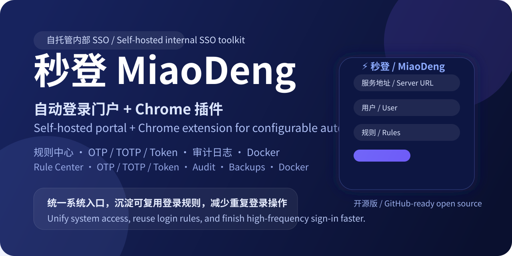

# MiaoDeng

[中文 README](./README.md)



Self-hosted portal and Chrome extension for internal system auto-login.

## What it does

- Centralized portal for internal systems
- Credential storage for multiple users
- Configurable login rule center
- Chrome extension for auto-fill and auto-submit
- Support for password / OTP / TOTP / token-based login flows
- Audit logs, backups, update center, and Docker deployment

## Quick Start

### Docker

```bash
cp .env.docker.example .env
docker compose up -d --build
docker compose ps
docker compose logs -f sso-portal
```

Default URL:

- Portal: `http://localhost:6680`
- Data dir: `./data`

### Local Python

```bash
python3 server.py
```

## Install the Chrome Extension

Recommended flow: **ZIP install**

1. Open the portal
2. Click **Install Extension**
3. Download and unzip the extension package
4. Open `chrome://extensions/` in Chrome
5. Enable **Developer mode**
6. Click **Load unpacked**
7. Select the `chrome-extension` directory
8. Open the extension popup
9. Enter your portal URL and save

## Environment Variables

See `.env.docker.example`.

Important variables:

- `ADMIN_PASSWORD`
- `DEFAULT_USER_PASSWORD`
- `ENCRYPT_KEY`
- `SESSION_TTL_HOURS`
- `REMEMBER_SESSION_TTL_DAYS`
- `BACKUP_INTERVAL_HOURS`
- `BACKUP_RETENTION_COUNT`

## Development Checks

```bash
python3 - <<'PY'
from pathlib import Path
html = Path('sso-portal.html').read_text()
start = html.rfind('<script>')
end = html.rfind('</script>')
Path('/tmp/sso_portal_inline.js').write_text(html[start+len('<script>'):end])
print('/tmp/sso_portal_inline.js')
PY

node --check /tmp/sso_portal_inline.js
node --check chrome-extension/content.js
node --check chrome-extension/popup.js
node --check chrome-extension/background.js
python3 -m unittest tests.test_server_api tests.test_frontend_regressions -q
node --test tests/test_autosubmit_utils.mjs
docker compose config
```

## Security & Data

This repository does **not** include real runtime data.

Never commit:

- `.env`
- `data/` real files
- SQLite databases
- backups
- encryption keys
- TLS private keys

See:

- [`SECURITY.md`](./SECURITY.md)
- [`CONTRIBUTING.md`](./CONTRIBUTING.md)
- [`ARCHITECTURE.md`](./ARCHITECTURE.md)
- [`ROADMAP.md`](./ROADMAP.md)

## License

MIT
